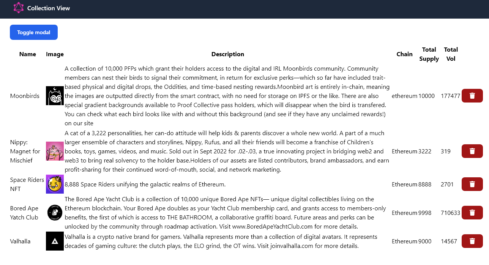
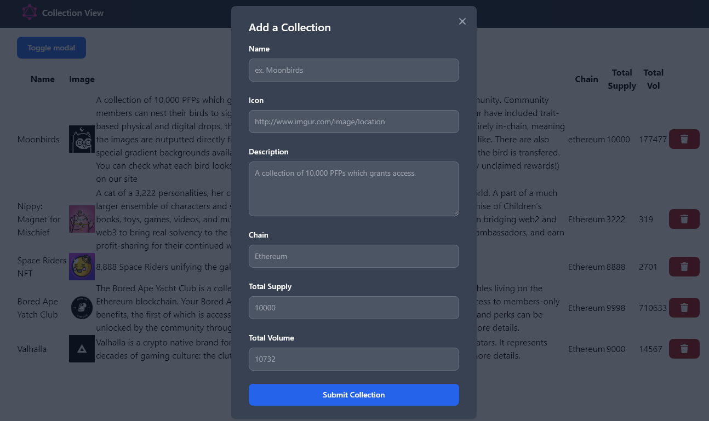

# Basic GraphQL Express Server

This is a template which uses a graphQL express server that demonstrates a MERN stack featuring the following:
- env config file
- client and server example
- sample queries  
- modal to add entries to collection
- cache fetch and updating (optimize cache data instead of re-requesting entire dataset)
- read from a mongodb cloud (checkout feature/simple-json to see example with loading from json file instead)

### Branches

- feature/simple-json: graphql server using json as data
- feature/mongodb: graphql server querying mongodb
- feature/mern-app: graphql server querying mongodb with frontend app

# Preview 



# How to run

1. Server: cd server, create a mongodb, copy the .env file and set the uri to point to the new mongo you created:
```
cd server
npm install
cp .env.example .env
npm run runDev
```
For more info checkout the readme file within server folder.

2. React Client: cd client and run the client
```
cd client
npm install
npm run start
```
